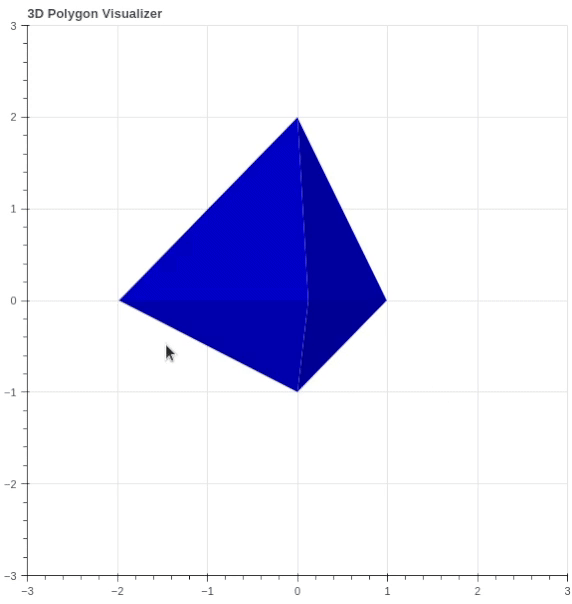
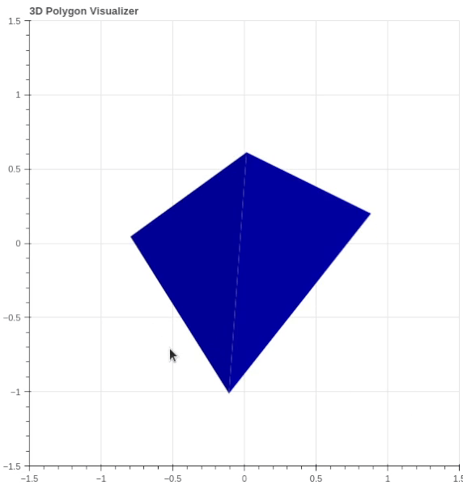
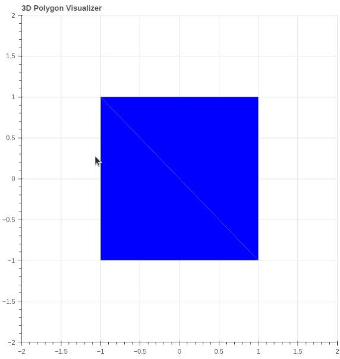

# 3D Polygon Visualizer
This program is to complete software assessment for Neocis. The key challenge is to use 2D plotting functions only to achieve 3D plotting, with basic user interaction functionality.

## Environment Setup
I choose Python because of its fast prototyping capability and efficient numpy library for matrix operations (thus the operations are vectorized as much as possible). Packages used:
```
numpy
bokeh
```

## Quick Start
To run part 1: <br>
`bokeh serve --show main.py` <br>


To run part 2: <br>
`bokeh serve --show main.py --args --render_mode surface` <br>


## Part 1
Because the observer/camera is at infinite distance, parallel projection is applied to the canvas. We use rotation matrix to calculate the current 3D location of each vertex, and the x and y values are the coordinate on the canvas.

Based on the tasks, the plotting library must satisfy the following requirements:
- Can plot 2D polygons: vertices, edges and faces, with user defined color
- Has callback API to respond to mouse click and drag action
- Have 2D plotting capability only

The plotting library I choose is [Bokeh](https://bokeh.org/), when the program executes, it will open a browser window to show the plot.

The most tricky part of this assessment is to define a custom callback function to the mouse drag action, which Bokeh supports through its [Pan, PanEnd and PanStart events](https://docs.bokeh.org/en/latest/docs/reference/events.html#bokeh.events.Pan). Bokeh supports two types of callback function:
- [JavaScript](https://docs.bokeh.org/en/latest/docs/user_guide/interaction/js_callbacks.html): Still calling the Python code to execute, but the callback function needs to be written in JavaScript, which has limited functionality
- [Python](https://docs.bokeh.org/en/latest/docs/user_guide/interaction/python_callbacks.html): Need to create a Bokeh server to run the program (thus the command line will start with `bokeh serve --show`), but the advantage is that callback function can be written in Python, and can utilize numpy to accelerate matrix operations

Therefore, I choose the Python callback method, with its ["Single module format"](https://docs.bokeh.org/en/latest/docs/user_guide/server/app.html#single-module-format)

The callback function is defined in `Window` class, and is called when the mouse is dragged. The callback function will transfer `delta_x` and `delta_y` to the rotation angle, and use rotation matrices to calculate the new 3D location of each vertex, then update the [ColumnDataSource](https://docs.bokeh.org/en/latest/docs/user_guide/data.html#providing-data-as-a-columndatasource) for elements in the plot. The re-plotting will be triggered automatically. To ensure the same rotation scale among each drag, an accumulated rotation matrix is stored, and updated at each `PanEnd` event.

## Part 2
Because the polygon only contains triangle surfaces, each surface is either entirely facing camera, or entirely facing backwards (cannot be partially visible, if not taking self-occlusion into account). Therefore, the easiest way to decide if the surface is visible is to calculate the surface normal and see whether its z compenent is positive.

Surface normals can be calculated from the cross product of two edges of the face. Usually, a mesh file will have a fixed vertices order for all faces (counter-clockwise in most cases), and whether the calculated surface normal is pointing outwards or inwards can be easily determined. However, this is not specified in the instruction, and the give object file does not have a unified order.

Therefore, I implemented a walk-around for this issue, by calculating an object center by averaging all vertices, and use surface normals that have a positive dot product with the vectors from object center to face centers. This method has one limitation that the object center must be inside the object, so it might not work for some concave objects. But for this assessment it should be sufficient.

The angle between surface normal and z-axis is arccos() of the z component of normal vector, this angle is used to interpolate the color of that surface. [MultiPolygons](https://docs.bokeh.org/en/2.4.1/docs/reference/models/glyphs/multi_polygons.html) in Bokeh is used to plot the 2D triangle projection of each visible face.

The program can render different polygon files, by adding arguments to the command line. Note that all `--` arguments must appear after a `--args` argument, due to using Bokeh server.

`bokeh serve --show main.py --args --render_mode surface --obj_path data/tetrahedron.txt` <br>


`bokeh serve --show main.py --args --render_mode surface --obj_path data/cube.txt --fill_scale 2.0` <br>

